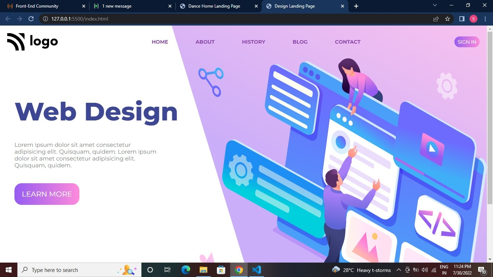

# Design Landing Page (Project 08)

By Soumyadeep Laha

## Learnings from this project

- Learn about SVG images.
- Positioned the various svg images using the CSS position propeerty.
- In-depth researched about the Box Model and there usages. 
- More knowledge gained on CSS flexbox.

## Time to taken to complete the project

It took me around 1 hours 15 mins time to complete.

## Screen Shorts of the project

## Live link to the project

